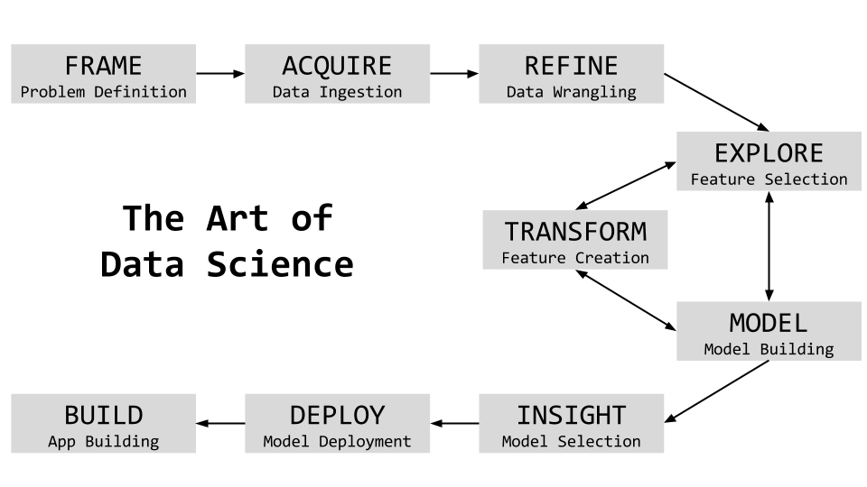

## Build & Deploy ML Models in the Cloud
## Rihad Variawa, Data Scientist
## FinTech Industries

**Motivation for this task**

- Solve a business problem
- Understand the end-to-end approach
- Build a data-driven Machine Learning application on the cloud

**Approach** to take a case-driven task to showcase this. We will aim to go-wide VS. go-deep. The approach will be both practical and scalable. Let's start by understanding the overall steps involved in building a data-driven application.

### Art of Data Science Process

This task delves deep into the process and how this can be used to solve the problem end-to-end.

But before we get there, we need the repo - that has the data and code that we want to run in cloud.

The first step is to create a virtual environment. It's good practice to create a separate environment for each project.

    $ cd loan-default
    $ virtualenv mlcloud # mlcloud is the name of the virtual environment

    $ source mlcloud/bin/activate # activate the virtual environment

Now, the required libraries need to be installed. The libraries needed for the task are listed at requirements.txt.

    $ pip install -r requirements.txt

Now, the virtual environment needs to be activated for `Jupyter Notebook`

    $ python -m ipykernel install --user --name=mlcloud

We are all set. Now, open the jupyter notebook by entering the URL provided in the welcome message, in the browser
